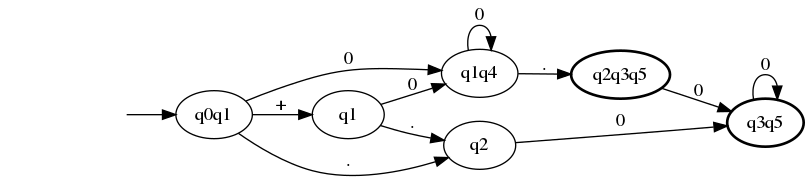
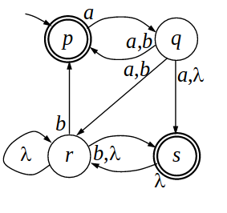
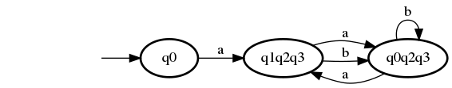

# Transformación de un autómata no-determinista a uno determinista.

Autores:

   * Nicolás Serrano (nicolas.serranos@estudiante.uam.es)
   * Pablo Sánchez (pablo.sanchezredondo@estudiante.uam.es)

## Estructuras utilizadas y funcionamiento general del algoritmo.

Hemos utilizado una única estructura, Estado, que tiene tres atributos:
   
   \begin{verbatim}
   typedef struct {
    int id;
    int estados[MAX_ESTADOS];
    int num_estados;
   } Estado;
   \end{verbatim}

Donde `id` es un identificador desde donde podremos acceder a el nuevo estado que hemos creado. El array `estados` es la lista de estados que lo componen debido a los no-determinismos. `num_estados` es el número de estados que hay en `estados`.

Antes de empezar con el algoritmo, creamos el estado 0 de nuestro nuevo autómata, introducimos el estado inicial del afnd y todos los estados a los que llegas con transiciones lambda.

La tabla `trans_table[estado.id][num_simbolo]` es donde vamos a guardar a donde se transiciona con estado y simbolo.

Cada iteración del bucle while principal estudia el estado 

`nuevos_estados[iter_nuevosestados]` hasta que haya tantos estados nuevos como iteraciones estudiadas:

   1. Crear un nuevo estado: Crea un nuevo estado y lo añade a nuestra lista de nuevos estados.
   1. Transitar: Comprueba para el símbolo `k` todas las transiciones desde el estado que estamos estudiando en esta iteración. Por cada transición con ese símbolo que te lleve a otro estado, se añade ese estado al estado previamente creado.
   1. Comprueba que hay algun estado al que se transita con este símbolo. Si no la hay, pasa a la siguiente iteración sobreescribiendo el nuevo estado creado.
   1. Comprueba que no haya un estado repetido.
   1. Guardamos la transición en la tabla de transiciones.

## Resultados

Resultado ejemplo dado: 

---

Segundo ejemplo, ejemplo2.c

No determinista: 

Determinista: 

---

\break
Ejemplo numero 3:

No determinista:

Determinista:
